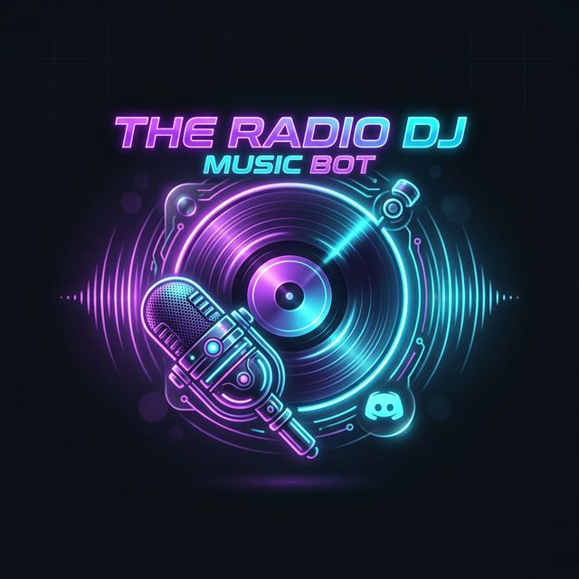

<p align="center">
  
</p>

# 🎵 The Radio DJ Music Bot — v420.0.3 (Radio 420)
> *🎙️ WE'RE NOT OFF THE AIR, WE'RE *ON* THE AIR. PERMANENTLY.*

> *(Cue: Sub-bass rumble that reorganizes your internal organs... a lighter flicks... digital thunder rolls across the frequency spectrum...)*
>
> 📡 **ATTENTION ALL UNITS. THIS IS NOT A TEST.** This is the real thing. This is the station that never stops — the frequency that doesn't just *play music*, it *hosts a show*.
>
> You've seen music bots. We all have. Sad little URL parsers that choke on playlists and sound like they're broadcasting through a tin can attached to a string. They "just play songs." No personality. No fire. **NO VISION.**
>
> **THIS IS NOT THAT BOT.** This is a full-goddamn radio station that lives inside your Discord server — with a DJ that has *opinions*, a co-host powered by a local LLM that will absolutely roast your music taste, an OBS studio wired up to YouTube Live, and a TTS engine that runs on a GPU and sounds so good you'll forget it's not human.
>
> **TL;DR:** It's a radio station. In Discord. That actually slaps.

---

The Radio DJ Music Bot is a self-contained Discord music bot built with Python and `discord.py`. It plays audio from YouTube (URLs, searches, playlists) and Suno (direct song URLs) directly into Discord voice channels, with a full radio DJ personality, AI side host, OBS Studio integration for YouTube Live streaming, a web dashboard (Mission Control), soundboard, and more features than any reasonable person would ever need.

---

## 🐳 Quick Install (Docker)

The absolute fastest way to get your radio station running. One command starts **5 services** automatically: the bot, Kokoro-TTS (GPU), MOSS-TTS-Nano (CPU fallback), Ollama, and OBS Studio!

```bash
# 1. Download the pre-configured starter files
curl -O https://raw.githubusercontent.com/jayis1/the-Dj-music-bot-sidestepping-ollama/main/docker-compose.yml
curl -o .env https://raw.githubusercontent.com/jayis1/the-Dj-music-bot-sidestepping-ollama/main/.env.example

# 2. Add your bot token
nano .env    # Just paste your DISCORD_TOKEN here, everything else is ready!

# 3. Launch it!
docker compose up -d

# 4. Open the Mission Control Dashboard
open http://localhost:8080
```

> **Kokoro-TTS** starts automatically on port 8880 (NVIDIA GPU required for GPU acceleration). **MOSS-TTS-Nano** starts as CPU fallback on port 18083. **Ollama** starts on port 11434. **OBS Studio** starts headlessly on port 4455 (WebSocket) with optional VNC on port 5900. The bot detects all services and uses them immediately — no extra config needed.

**Pre-built image:** `ghcr.io/jayis1/the-dj-music-bot:v420.0.3`  
**OBS image:** `ghcr.io/jayis1/the-dj-music-bot/obs-studio:v420.0.3`
**Platforms:** `linux/amd64`, `linux/arm64`  
**Releases:** [GitHub Releases page →](https://github.com/jayis1/the-Dj-music-bot-sidestepping-ollama/releases)

---

## ✨ Features

### 🎧 Music & Playback
- Play from **YouTube** (URLs, search queries, full playlists) and **Suno.com**
- **Queue management** — add, remove, clear, shuffle, drag-and-drop reorder
- **Volume** (0–200%) and **Speed** (0.25×–4.0×) control — both live-adjustable from dashboard
- **Loop** toggle for the current track
- **Auto-DJ / Radio mode** — queue auto-refills from a YouTube playlist, a preset, or recently played history
- **Gapless crossfade** between tracks (configurable fade-in duration)

### 📡 Master Broadcast Engine
- **Universal UDP Multiplexing** — Bot detaches from Discord Voice Client and outputs to a Master FFmpeg Node via `udp://127.0.0.1:12345`
- **Zero-Latency Transitions** — PCMBroadcaster middleware ensures TTS, sound effects, and music seamlessly fade continuously on YouTube Live with no bitrate drops or gaps
- **Dynamic Graphical HUDs** — Live YouTube layouts read from text-files bound to FFmpeg `reload=1`, updating visual titles instantly
- **YouTube Live via OBS** — Stream through OBS Studio natively (single streaming point) or direct RTMP fallback

### 🔊 TTS Engine (4-engine cascading fallback)
- **Kokoro-FastAPI** *(default, GPU-accelerated)* — 82M param model, ~35-100× realtime on GPU, OpenAI-compatible `/v1/audio/speech` endpoint, 30 built-in voices, voice mixing
- **MOSS-TTS-Nano** *(fallback)* — 0.1B param voice cloning, CPU-friendly, prompt `.wav` files for custom voices
- **VibeVoice** — alternative local server (~300ms latency)
- **Edge TTS** *(last resort)* — Microsoft cloud voices, 100+ in 40+ languages, no server needed
- **Fallback chain:** Kokoro → MOSS → Edge TTS — the bot *never* goes silent
- **AI Side Host** now uses the same configured TTS engine (with a separate voice), not hardcoded to Edge TTS
- **Pregeneration** — both DJ and AI host lines are pre-generated during songs for zero-latency playback

### 🎙️ DJ Mode
- TTS voice commentary between every track (intro, transition, outro)
- **924 built-in DJ lines** across 10 categories — ~100 with embedded sound effect tags
- **Custom DJ lines** — add your own via the web dashboard with `{title}`, `{sound:name}` tags
- **DJ bed music** — ambient pad plays softly under commentary for a real radio feel
- **Shoutouts** — `?shoutout @user` fires a live on-air shoutout with TTS + sound effects
- **Per-guild toggle** — `?dj` on/off per server, voice changeable with `?djvoice`
- Works with **all four TTS engines** — Kokoro, MOSS, VibeVoice, or Edge TTS
- **🤖 AI Side Host** — a second radio personality powered by a local LLM (Ollama) that writes its own spontaneous banter, hot takes, and shoutouts alongside the main DJ

### 🎬 OBS Studio Integration
- Headless OBS Studio with **obs-websocket 5.x** control from Mission Control
- **4 default scenes** for radio broadcast (Now Playing, DJ Speaking, Waiting, Overlay Only)
- **Auto scene switching** — bot switches scenes based on playback state
- **Start Streaming** button configures RTMP + stream key, creates browser overlay + audio sources, switches to overlay scene, and starts streaming — all in one click
- **Stream key management** — save your YouTube stream key on the OBS page; it's pushed to OBS automatically
- Streaming, recording, replay buffer, virtual camera — all from the web dashboard
- Browser source overlay — OBS can embed the Mission Control overlay page

---

## 🔊 Four-Engine TTS Architecture

The bot supports four TTS engines with cascading fallback. Configure via `.env` — no code changes needed.

| | **Kokoro** *(default)* | **MOSS** *(fallback)* | **VibeVoice** | **Edge TTS** *(last resort)* |
|---|---|---|---|---|
| `TTS_MODE` | `kokoro` | `moss` | `vibevoice` | `edge-tts` |
| Latency | ~50-300ms (GPU) | ~2-8s (CPU) | ~300ms | 2-5 seconds |
| Server | Kokoro-FastAPI Docker | moss-tts-server Docker | VibeVoice-Realtime | None (cloud) |
| Voices | `af_bella`, `am_adam`, `bf_emma`, etc. (30+) | `en_warm_female`, `en_news_male`, `da_female`, `da_male` | `en-Carter_man`, etc. | `en-US-AriaNeural`, `da-DK-JeppeNeural`, etc. |
| Voice mixing | ✅ `af_bella(2)+af_sky(1)` | ❌ | ❌ | ❌ |
| GPU | Required (NVIDIA CUDA) | Not needed | Required for speed | N/A |
| Internet | Not required | Not required | Not required | Required |
| Open source | ✅ (Apache 2.0) | ✅ | ✅ | ❌ |

**Fallback chains:** `kokoro → moss → edge-tts` | `moss → edge-tts` | `vibevoice → edge-tts`

### 🍡 Setting Up Kokoro-FastAPI *(recommended)*
```bash
# NVIDIA GPU required — GPU-accelerated TTS with best quality
docker run --gpus all -p 8880:8880 ghcr.io/remsky/kokoro-fastapi-gpu:latest
```
Then set in `.env`:
```env
TTS_MODE=kokoro
KOKORO_TTS_URL=http://localhost:8880    # or http://kokoro-tts:8880 in Docker
DJ_VOICE=af_bella                       # American female (primary DJ voice)
OLLAMA_DJ_VOICE=am_adam                 # American male (AI side host voice)
```

**Voice names:** Prefix format `[abefhjpz][fm]_name`:
- `af_*` = American female (af_bella, af_sky, af_nicole, af_sarah)
- `am_*` = American male (am_adam, am_michael)
- `bf_*` = British female (bf_alice, bf_emma, bf_isabella)
- `bm_*` = British male (bm_daniel, bm_george, bm_lewis)
- Plus French, Hindi, Portuguese, Chinese voices

**Voice mixing:** Combine voices with weighted ratios: `af_bella(2)+af_sky(1)` = 67% Bella + 33% Sky

### Setting Up MOSS-TTS-Nano *(CPU fallback)*
```bash
# CPU — always works, no GPU needed
docker run -d --name moss-tts --restart unless-stopped \
  -p 18083:18083 ghcr.io/jayis1/the-dj-music-bot/moss-tts-server:v420.0.3

# Or native install:
pip install moss-tts-nano
moss-tts-nano serve --port 18083
```
```env
TTS_MODE=moss
MOSS_TTS_URL=http://localhost:18083
DJ_VOICE=en_warm_female
OLLAMA_DJ_VOICE=en_news_male
```

**Custom Voices:** Add `.wav` prompt audio files (5-30s clean speech) to `assets/moss_voices/`. Naming convention: `en_warm_female.wav`, `da_male.wav`, etc.

**Danish voices:** Built-in Danish voices `da_female` and `da_male` use MOSS voice cloning for MOSS mode, and automatically map to `da-DK-SofieNeural` / `da-DK-JeppeNeural` when falling back to Edge TTS.

### Setting Up VibeVoice
```bash
git clone https://github.com/microsoft/VibeVoice
cd VibeVoice
python3 demo/vibevoice_realtime_demo.py --model_path microsoft/VibeVoice-Realtime-0.5B --device cpu
```
```env
TTS_MODE=vibevoice
VIBEVOICE_TTS_URL=http://localhost:3000
DJ_VOICE=en-Carter_man
```

> The **Settings page** shows a live TTS Engine status card — green if the configured engine is reachable, red with instructions if it's not.

---

## 🎙️ DJ Mode — Details

When DJ Mode is on (`?dj`), the bot speaks between every track like a real radio host:

- **Intro** — introduces the first song of the session
- **Transitions** — back-announces what just played, introduces what's next
- **Station IDs** — drops "You're tuned in to [Station] Radio" randomly
- **Outros** — plays a smooth sign-off when the queue empties
- **Time-of-day adaptation** — different tone for morning, afternoon, evening, late night

**Sound Effect Tags:** Embed `{sound:airhorn}` anywhere in a custom DJ line and the bot will play that sound right after speaking. 55+ sounds available.

**Pregeneration:** While a song plays, the bot pre-generates TTS audio files for the next 5 songs in the queue. Both main DJ lines AND AI side host lines are pre-generated, so transitions are near-instant.

---

## 🤖 AI Side Host — Details

The AI side host is a **second radio personality** that chimes in alongside the main DJ.

### How It Works
1. Main DJ picks a structured line (intro/transition/outro) as usual
2. AI side host has a random chance to also speak (controlled by `OLLAMA_DJ_CHANCE`)
3. The AI **receives the main DJ's spoken line** as context and can react to it
4. Both lines go through the same TTS → sound effects → playback pipeline
5. Each host has its own voice so they sound like different people
6. **Both DJ and AI host lines are pre-generated** during the previous song for zero-latency playback

### Voice Configuration
The AI side host uses a **separate TTS voice** from the main DJ, configured by `OLLAMA_DJ_VOICE`. The default depends on your TTS engine:

| Engine | Main DJ Default | AI Side Host Default |
|--------|----------------|---------------------|
| Kokoro | `af_bella` (American female) | `am_adam` (American male) |
| MOSS | `en_warm_female` (warm female) | `en_news_male` (news male) |
| VibeVoice | `en-Carter_man` | `en-Carter_man` |
| Edge TTS | `en-US-AriaNeural` | `en-US-GuyNeural` |

> Previously, the AI side host was hardcoded to Edge TTS with `en-US-GuyNeural` regardless of the configured engine. Now it uses the same engine as the main DJ with a distinct voice — giving you Kokoro's GPU-accelerated quality for *both* hosts.

### Banter Categories

**Independent (fires any time):**
| Category | What the AI does |
|---|---|
| `random_thought` | Drops a funny off-script observation |
| `listener_shoutout` | Hypes or jokes about the crowd |
| `song_roast` | Gently roasts the current/next song |
| `station_trivia` | Deadpan absurd station facts |
| `queue_hype` | Jokes about the queue length |
| `vibe_check` | Rates the mood with comedy |
| `hot_take` | Spicy harmless music opinion |
| `request_prompt` | Begs listeners to request songs |

**Reactive (fires when AI knows what the DJ just said — 60% weight):**
| Category | What the AI does |
|---|---|
| `react_agree` | Agrees with the DJ + adds a funny twist |
| `react_disagree` | Playfully pushes back on the DJ |
| `react_one_up` | Escalates the DJ's joke |
| `react_tangent` | Takes the DJ's line somewhere unexpected |

### 🧠 Custom Ollama Model (Auto-Created on Startup)

Instead of sending a large system prompt on every API call, the bot automatically creates a custom Ollama model called `mbot-sidehost` with the DJ personality **baked in**:

```
FROM gemma4:latest
SYSTEM """You are the AI side host on MBot Radio — the studio joker..."""
```

**Startup flow:** On `on_ready`, the bot checks if `mbot-sidehost` exists in Ollama. If not, it creates it from the base model automatically. If the base model isn't pulled yet, it logs a warning with the exact `ollama pull` command needed.

| Scenario | Behavior |
|---|---|
| Custom model created ✅ | Calls `mbot-sidehost` directly — no prompt on every request |
| Custom model missing ⚠️ | Falls back to base model + inline system prompt |

### Quick Start
```bash
# 1. Install Ollama
curl https://ollama.ai/install.sh | sh

# 2. Pull a model (see recommendations below)
ollama pull phi3:mini

# 3. Set in .env
OLLAMA_DJ_ENABLED=true
OLLAMA_MODEL=phi3:mini

# 4. Toggle on in Discord
?aidj
```

### Recommended Models by VRAM
| Model | VRAM | Speed | Quality |
|---|---|---|---|
| `gemma2:2b` | ~1.5 GB | ⚡ Fastest | Good |
| `llama3.2:3b` | ~2.0 GB | ⚡ Very fast | Very good |
| `phi3:mini` (3.8B) | ~2.3 GB | ⚡ Very fast | **Recommended** |
| `gemma4:latest` | ~3.5 GB | Fast | Best quality |
| `mistral:7b-q4` | ~4.1 GB | Slower | Avoid on ≤4 GB VRAM |

---

## 🎬 OBS Studio Integration

OBS Studio runs **headlessly via Xvfb** and is fully controlled from Mission Control — no monitor or physical display needed.

### YouTube Live Streaming from Mission Control

The OBS page has a **📺 YouTube Live Stream Key** section where you configure your stream key. When you click **Start Streaming**:

1. Mission Control pushes the RTMP server URL + stream key to OBS
2. Creates a browser overlay source (if not already present) pointing to the overlay page
3. Creates an FFmpeg audio source (if not already present) capturing the bot's audio via UDP
4. Switches to the "📺 Overlay Only" scene
5. Starts OBS streaming

The stream key is also pushed to OBS at startup and whenever you save it, so OBS always has the latest key.

### Default Scene Collection

| Scene | When it's used |
|---|---|
| ️ **Now Playing** | A song is currently playing |
| 🎙️ **DJ Speaking** | The DJ (or AI side host) is delivering a voice break |
| ⏳ **Waiting** | The queue is empty — station is in idle |
| 📺 **Overlay Only** | YouTube Live overlay / browser source is active |

### Auto Scene Switching

Set `OBS_AUTO_SCENES=true` in `.env` and the bot automatically switches scenes based on playback state:

| Playback state | Scene selected |
|---|---|
| Song playing | ️ "Now Playing" |
| DJ speaking | 🎙️ "DJ Speaking" |
| Queue empty | ⏳ "Waiting" |
| YouTube Live overlay | 📺 "Overlay Only" |

### Docker

OBS starts automatically with `docker compose up -d`:
- **Port 4455** — obs-websocket 5.x for remote control
- **Port 5900** — optional VNC for visual debugging

### Bare-Metal

`bash start.sh` does everything automatically:
- Installs OBS Studio (if not present)
- Configures obs-websocket with a generated password
- Starts headless OBS via `xvfb-run`

### Proxmox LXC

`bash setup-lxc.sh` does the same as bare-metal, plus:
- Creates systemd services for OBS and the bot
- Designed for **Debian 12 + GPU passthrough** LXC containers

### Configuration
```env
OBS_WS_ENABLED=true
OBS_WS_HOST=localhost
OBS_WS_PORT=4455
OBS_WS_PASSWORD=          # Auto-generated by start.sh if blank
OBS_AUTO_SCENES=false     # Set true for auto scene switching
```

---

## 🌐 Web Dashboard — Details

Available at `http://your-server:8080/`

### Pages
| Page | Path | Description |
|---|---|---|
| **Dashboard** | `/` | Live playback, queue, volume/speed controls |
| **Radio** | `/radio` | DJ voice, Auto-DJ config, AI voice selector, YouTube Live controls, Recently Played |
| **Queue Manager** | `/queue` | Full queue management with drag-and-drop |
| **Soundboard** | `/soundboard` | Sound effects grid + upload |
| **DJ Lines** | `/dj-lines` | Custom DJ line CRUD with visual `{sound:name}` badges |
| **Settings** | `/settings` | System info, Ollama status, Restart/Shutdown |
| **🎬 OBS Studio** | `/obs` | Stream key config, scene control, streaming, recording, sources |

### 📋 Activity Log Panel
Click **📋 Log** in the sidebar for a live slide-out log panel:
- Real-time SSE streaming from the Discord log channel
- **Filter buttons:** All / Info / Warn / Error
- **📋 Copy button** — three-tier clipboard strategy (works on HTTP and HTTPS)
- Color-coded severity badges (INFO=blue, WARNING=amber, ERROR=red, DEBUG=gray)
- Auto-reconnects if the connection drops

### 🔄 Dashboard Auto-Refresh System
| System | Interval | What it updates |
|---|---|---|
| Progress bar ticker | Every 1 second | Progress fill width + elapsed time text |
| Soft refresh | Every 30 seconds | Guild status badges, DJ controls, queue, listeners, volume, song title |
| Song-end refresh | When progress hits 100% | Full dashboard state for the new track |
| Fallback refresh | Every 3 minutes | Full page reload as safety net |

### AI Side Host Dashboard Controls
- 🃏 **AI On/Off button** on dashboard cards (glows purple when active)
- 🃏 **AI badge** on guild cards when side host is enabled
- **AI Side Host Voice selector** on the Radio page
- **Ollama status check** on the Settings page with setup instructions

### 🔀 Reverse Proxy Support *(Settings page)*
Enable the **🔀 Reverse Proxy** card on the Settings page for safe exposure behind Nginx or Nginx Proxy Manager. Set in `.env`:
```env
REVERSE_PROXY=true
TRUSTED_PROXY_COUNT=1
```

### API Endpoints (selected)
| Endpoint | Method | Description |
|---|---|---|
| `/api/<guild_id>/play` | POST | Play/resume |
| `/api/<guild_id>/skip` | POST | Skip track |
| `/api/<guild_id>/volume` | POST | Set volume |
| `/api/<guild_id>/speed` | POST | Set playback speed |
| `/api/<guild_id>/ai_dj_toggle` | POST | Toggle AI side host |
| `/api/<guild_id>/ai_dj_voice` | POST | Set AI side host voice |
| `/api/voices` | GET | List TTS voices (30-min cached) |
| `/api/obs/streaming/configure_and_start` | POST | Configure stream settings + start OBS streaming |
| `/api/obs/stream_key_status` | GET | Check if stream key is configured (checks .env + OBS) |
| `/api/save_stream_key` | POST | Save stream key to .env + push to OBS |

### Configuration
```env
WEB_HOST=0.0.0.0
WEB_PORT=8080

# Leave blank for open access, or set a password to enable login
WEB_PASSWORD=

# Optional: pin all now-playing embeds to a specific Discord channel
NOWPLAYING_CHANNEL_ID=0
```

---

## 📜 Command Reference

*(Default prefix: `?`)*

### 🎧 Music Commands
| Command | Description |
|---|---|
| `?join` | Join your voice channel |
| `?leave` | Disconnect from voice |
| `?play <URL/query>` | Play from YouTube (URL, search, or Suno link) |
| `?search <query>` | Search YouTube — shows top 10, pick with `?play <number>` |
| `?playlist <URL>` | Queue an entire YouTube playlist |
| `?radio <URL>` | Queue a YouTube playlist for long radio sessions |
| `?queue` | Show the current queue |
| `?skip` | Skip to next track |
| `?stop` | Stop playback and clear queue |
| `?pause` / `?resume` | Pause / Resume |
| `?clear` | Clear queue (keeps current song) |
| `?remove <number>` | Remove a specific track |
| `?nowplaying` | Show Now Playing embed with controls |
| `?volume <0-200>` | Set volume (100 = normal) |
| `?loop` | Toggle loop for current song |
| `?shuffle` | Shuffle the queue |
| `?speedhigher` / `?speedlower` | Adjust playback speed |

### 🎙️ DJ Commands
| Command | Description |
|---|---|
| `?dj` | Toggle DJ mode on/off |
| `?djvoice [name]` | Show or set the DJ's TTS voice |
| `?djvoices [prefix]` | List available voices (e.g. `?djvoices ja` for Japanese) |
| `?shoutout @user` | Give a live on-air shoutout with TTS + sound effects |

### 🤖 AI Side Host Commands
| Command | Description |
|---|---|
| `?aidj` | Toggle AI side host on/off — shows model, voice, chime-in chance |
| `?aidjvoice [name]` | Show or set the AI side host's separate TTS voice |

### 📺 YouTube Live Commands
| Command | Description |
|---|---|
| `?golive [stream_key]` | Start YouTube Live stream (mirror mode) |
| `?stoplive` | Stop the YouTube Live stream |
| `?livestatus` | Check YouTube Live stream status |

### ⚙️ Admin Commands *(Bot owner only)*
| Command | Description |
|---|---|
| `?shutdown` | Safely shut down the bot |
| `?restart` | Restart (auto-reboots if using launcher scripts) |
| `?fetch_and_set_cookies <URL>` | Fetch cookies for age-restricted YouTube content |

---

## ⚙️ Configuration Reference

### Required
```env
DISCORD_TOKEN=your_discord_bot_token
```

### Optional — Core
```env
YOUTUBE_API_KEY=           # Needed for ?search command
LOG_CHANNEL_ID=           # Discord channel ID for log shipping
BOT_OWNER_ID=             # Your Discord user ID (for admin commands)
STATION_NAME=MBot         # Station name in DJ lines ("You're tuned in to MBot Radio")
AUTODJ_SOURCE=            # YouTube playlist URL, "preset:Name", or blank for history replay
NOWPLAYING_CHANNEL_ID=    # Pin now-playing embeds to a specific channel (0 = follow command)
```

### Optional — Web Dashboard
```env
WEB_HOST=0.0.0.0
WEB_PORT=8080
WEB_PASSWORD=             # Leave blank for open access
```

### Optional — TTS Engine
```env
# ── Which TTS engine to use ──────────────────────────────────────────
# "kokoro" (default) — GPU-accelerated, best quality, OpenAI-compatible API
# "moss" — CPU fallback, voice cloning via .wav prompt files
# "vibevoice" — Separate WebSocket server, ~300ms latency
# "edge-tts" — Microsoft cloud voices, always-available fallback
# Fallback chain: kokoro → moss → edge-tts (or moss → edge-tts, vibevoice → edge-tts)
TTS_MODE=kokoro

# Kokoro-FastAPI server URL (only used when TTS_MODE=kokoro)
# Docker: http://kokoro-tts:8880  |  Bare metal: http://localhost:8880
KOKORO_TTS_URL=http://localhost:8880

# MOSS-TTS-Nano server URL (fallback from kokoro, or primary if TTS_MODE=moss)
# Docker: http://moss-tts:18083  |  Bare metal: http://localhost:18083
MOSS_TTS_URL=http://localhost:18083

# Default DJ voice — Kokoro: af_bella, am_adam, bf_emma, etc.
# MOSS: en_warm_female, en_news_male, da_female, da_male
DJ_VOICE=af_bella

# Default AI side host voice (separate from main DJ)
OLLAMA_DJ_VOICE=am_adam
```

### Optional — AI Side Host (Ollama)
```env
OLLAMA_DJ_ENABLED=false           # Set to true to activate
OLLAMA_HOST=http://localhost:11434
OLLAMA_MODEL=gemma4:latest        # Recommended: phi3:mini for low VRAM
OLLAMA_DJ_CHANCE=0.25             # Chime-in chance per transition (0.0–1.0)
OLLAMA_DJ_TIMEOUT=15             # Seconds before skipping if Ollama is slow
```

### Optional — OBS Studio
```env
OBS_WS_ENABLED=true
OBS_WS_HOST=localhost
OBS_WS_PORT=4455
OBS_WS_PASSWORD=              # Auto-generated by start.sh
OBS_AUTO_SCENES=false          # Auto-switch scenes on playback state
```

### Optional — YouTube Live Streaming
```env
# ── YouTube Live Streaming ──────────────────────────────────────────
# Stream the bot's audio to YouTube Live via RTMP or OBS Studio.
# The bot streams audio + a static image card showing song titles + DJ speaking.
# Between songs, a "waiting for next track" card is shown.
#
# Two modes available:
#   🪞 Mirror — mirrors Discord audio to YouTube (bot must be in a voice channel)
#   🎙️ Curated (Shadow DJ) — you pick the songs, DJ speaks between them
#
# Get your stream key from YouTube Studio → Go Live → Stream Key,
# or configure it on the OBS page in Mission Control.
# You can also start/stop the stream at runtime with:
#   Discord:  ?golive  /  ?stoplive  /  ?livestatus
#   Web:      Mission Control → Radio → YouTube Live → Go Live
YOUTUBE_STREAM_ENABLED=false
YOUTUBE_STREAM_KEY=
YOUTUBE_STREAM_URL=rtmp://a.rtmp.youtube.com/live2
YOUTUBE_STREAM_BACKUP_URL=rtmp://b.rtmp.youtube.com/live2?backup=1
YOUTUBE_STREAM_IMAGE=
YOUTUBE_STREAM_GIF=
```

---

## 🚀 Installation

### Step 1 — Clone the repo
```bash
git clone https://github.com/jayis1/the-Dj-music-bot-sidestepping-ollama.git
cd "the-Dj-music-bot-sidestepping-ollama"
```

### Step 2 — Get your Discord Bot Token
1. Go to [Discord Developer Portal](https://discord.com/developers/applications) → New Application → Bot
2. Enable **Message Content Intent** and **Voice State Intent**
3. Copy your **Token**
4. Go to **OAuth2 → URL Generator**, check `bot` + `Administrator`, and invite the bot

### Step 3 — Run the setup wizard *(recommended)*
```bash
bash start.sh
```
The wizard installs all dependencies, walks you through your `.env` config interactively, **installs and configures OBS Studio**, generates an obs-websocket password, and starts headless OBS automatically.

#### Proxmox LXC (Debian 12 + GPU passthrough)
```bash
bash setup-lxc.sh
```
Sets up everything above plus creates systemd services for OBS and the bot.

### Alternative — Manual setup
```bash
chmod +x launch.sh
./launch.sh setup   # Install deps + create venv
cp .env.example .env
nano .env           # Paste your DISCORD_TOKEN
./launch.sh start   # Start in background (screen session)
```

### Troubleshooting
```bash
./launch.sh doctor   # Runs diagnostics (pytest checks)
./launch.sh attach   # Peek at live background process (Ctrl+A, D to detach)
```

---

## 🔧 Troubleshooting

| Problem | Solution |
|---|---|
| Bot won't play audio | Run `./launch.sh doctor` — likely missing `ffmpeg` or `libopus-dev` |
| DJ voice dropdown stuck on "Loading..." | First load fetches voices from the TTS server (~5s), then cached for 30 min |
| `?aidj` says Ollama not running | Install Ollama: `curl https://ollama.ai/install.sh \| sh` and pull a model: `ollama pull phi3:mini` |
| Ollama 404 error in logs | Model not pulled yet — the log now shows the exact `ollama pull <model>` command to run |
| Speed slider doesn't apply | Set speed only after the song has started playing; setting at 1.0× before queuing avoids the race |
| Kokoro TTS server down error | Ensure Kokoro-FastAPI is running: `curl http://localhost:8880/v1/audio/voices` — Settings page shows live status |
| MOSS TTS server down error | Ensure moss-tts-nano is running: `curl http://localhost:18083/api/warmup-status` — bot falls back to Kokoro or Edge TTS |
| MOSS warmup not ready | MOSS-TTS takes ~2-15s to load models on first infer request. Bot falls back to Kokoro or Edge TTS during warmup |
| MOSS missing prompt audio files | Ensure `assets/moss_voices/` contains `.wav` files (e.g. `en_warm_female.wav`, `da_female.wav`) |
| Danish voice falls back to English | Edge TTS fallback auto-maps `da_female` → `da-DK-SofieNeural`, `da_male` → `da-DK-JeppeNeural`. Ensure edge-tts is installed: `pip install edge-tts` |
| Dashboard 500 error | Check Jinja template ``/`` balance — run `./launch.sh doctor` |
| Age-restricted videos won't play | Use `?fetch_and_set_cookies <youtube_url>` to set cookies |
| Bot appears stuck in voice after crash | Restart bot — `on_ready` forces disconnect from all stale voice sessions |
| OBS not connected in Mission Control | Run `bash start.sh` — it installs and starts OBS automatically. Or install manually: `sudo apt install obs-studio` then start: `xvfb-run -a obs &` |
| OBS connection refused spam in logs | OBS is not running or WebSocket is not enabled. The bridge backs off for 30s after a failed connection. Start OBS with `bash start.sh`. |
| OBS "Start Streaming" doesn't stream to YouTube | The Start Streaming button now automatically configures RTMP server + stream key, creates browser overlay + audio sources, switches to the Overlay scene, then starts streaming. Make sure your YouTube stream key is saved on the OBS page first. |
| Stream key shows as web password | Fixed in v420.0.3 — stream key input now has `autocomplete="new-password"` to prevent browser auto-fill with saved credentials. |
| "Already playing audio" errors | Fixed in v420.0.3 — the central audio dispatcher now auto-stops any currently playing source, waits 150ms, then starts new audio. |
| CSRF token validation failed | Reload the Mission Control page — the CSRF token in your session may have expired |

---

## 📚 Further Documentation

For full technical details — architecture, cog internals, all API endpoints, module dependency graph, and development guide — see [GUIDE.md](GUIDE.md).


## 📄 License

MIT — see [LICENSE](LICENSE)